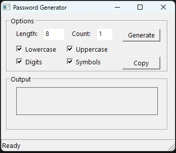
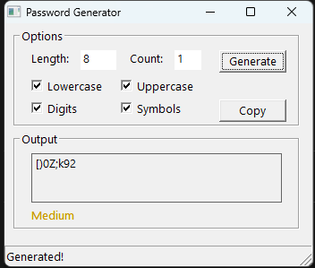

# Learn-C

This project is now a **feature-rich Password Generator** with a modern Win32 GUI.

## Prerequisites
- **GCC/MinGW**: Install [MinGW-w64](https://www.mingw-w64.org/) and add its `bin` directory to your PATH
- **make** (optional): For Makefile support, install make (e.g., from ezwinports, MSYS2, or GnuWin32) and add to PATH
- **comctl32.dll**: Standard on Windows, but you must link with `-lcomctl32`
- **Icon conversion tool**: Convert `C-icon.jpg` to `C-icon.ico` (any free online converter)
- **Windows 10+** recommended

## Features
- Native Windows GUI (Win32 API, no dependencies)
- Modern Segoe UI font and grouped layout
- Custom app icon (C-icon.ico)
- Tooltips for all controls
- Keyboard shortcuts:
  - Enter: Generate
  - Ctrl+C: Copy passwords
  - F1: About dialog
- Status bar for feedback (e.g., "Generated!", "Copied to clipboard!", errors)
- Remembers last settings (length, sets, count) between runs
- About dialog (F1 or menu)
- Password strength indicator (color-coded)
- Generate multiple passwords at once
- Copy to clipboard
- Select which character sets to include (uppercase, lowercase, digits, symbols)
- Output is multi-line, read-only, and easy to copy
- Window centers on startup

## How to Build

1. **Convert your icon:**
   - Convert `C-icon.jpg` to `C-icon.ico` (use any free online converter)
   - Place `C-icon.ico` in the project directory

2. **Build with GCC (MinGW):**
   ```
   gcc main.c -o learn.exe -mwindows -lcomctl32
   ```

3. **Run:**
   ```
   learn.exe
   ```

## Usage
- Set password length and count
- Select which character sets to include
- Click **Generate** or press **Enter**
- Copy results with **Copy** button or **Ctrl+C**
- See password strength below output
- Status bar shows feedback
- Press **F1** for About dialog
- Settings are saved automatically

## Screenshots
**Default view:**


**After generating a password:**


---

Created by [TMHSDigital](https://github.com/TMHSDigital)